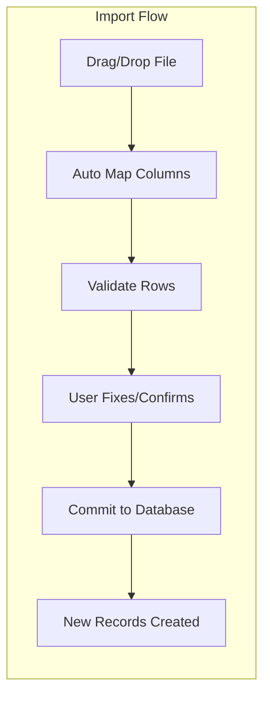

# Cargo ERP – Product Requirements Document  

**Executive Summary:** This PRD specifies a domestic cargo ERP that replaces manual spreadsheets with a unified Vibe-code system. It automates AWB (airway bill) and docket booking, invoicing, payments, and reporting. Key objectives are real-time visibility (dashboards, KPIs, outstanding ageing), zero-copy data import (drag-&-drop CSV/Excel/PDF with OCR), and strict credit control. For example, uploading a new Indigo rate PDF auto-populates routes/rates with editable markup (e.g. auto-fill ₹90, allow +₹3 charge). Customer GST numbers trigger instant lookup via API【48†L247-L252】. Core workflows (AWB→Invoice→Payment, Docket→Invoice→Outstanding) are fully mapped out. The system provides editable grid UIs (inline editing【26†L340-L343】), dynamic date filters, and exportable reports. All client requirements (invoice date = generation date, per-row import editing, credit-limit alerts, ageing views, etc.) are covered. Integration with OCR tools (e.g. Docparser) and airline/bank APIs is detailed. Acceptance tests and a phased roadmap ensure delivery of an MVP (core billing and AR) followed by advanced features. 

## Scope & Objectives  
The ERP covers **domestic** cargo operations end-to-end. It handles **daily bookings** (AWB/docket) through delivery, invoicing, payments and reporting. This fulfils the client’s primary goals: avoid error-prone Excel, centralize data, and automate billing/AR. E-invoicing and international modules are **out of scope** (client is domestic-only). The system must be cloud-native, multi-tenant (branches), and mobile-friendly for drivers/warehouse staff. Objectives include:  

- **Single Source of Truth:** All bookings, inventory, invoices, receipts, and financials in one system (no disconnected spreadsheets).  
- **Real-Time Visibility:** Dashboards for on-time delivery rates, order-to-cash cycle, outstanding balances and ageing【45†L344-L353】.  
- **Automation:** Auto-creation of invoices from AWB/dockets, auto-reconciliation of payments, and automatic credit-limit checks【51†L49-L52】.  
- **Ease of Use:** Drag-drop imports of rate sheets/invoices, inline-editable grids, and customizable reports to “see balance at a glance” (as the client requested).  
- **Compliance & Security:** GST lookup and validation (automated via API【48†L247-L252】), audit trails, and data encryption.  

## User Personas & Roles  
- **Operations Manager:** Monitors bookings, deliveries, disputes. Uses dashboards and exception lists.  
- **Sales / Customer Rep:** Enters new bookings (AWB/docket), reviews prices, issues invoices. Uses import tools and inline editing.  
- **Warehouse Clerk:** Scans/receives shipments (enter incoming AWBs/dockets), updates inventory. Uses mobile/handheld UI.  
- **Finance / Accountant:** Reviews invoices, posts payments, performs reconciliation. Uses AR ageing reports and data exports (Excel/CSV).  
- **Customer:** (External Portal) Tracks shipments, views outstanding invoices, and makes online payments.  
- **Admin:** Manages master data (customers, rates, user roles), sets credit limits, and configures system parameters (e.g. payment terms).  

## Core Modules  

- **Booking (AWB & Docket Workflows):**  
  - *AWB Entry:* Supports direct entry or airline API. On entering an AWB number, the system auto-fills origin, destination and standard Indigo rate (from the latest imported rate table). The user confirms details.  
  - *Docket Entry:* For house shipments (e.g. Uflex pickups), the user enters a docket number, selects the counterparty and manually inputs weight and any agreed rate. The system can also bulk-upload dockets via CSV. All bookings are date-stamped and associated with a customer.  

- **Rate Management:**  
  - Ability to upload new freight rate sheets (CSV/Excel/PDF). The system parses and maps them automatically (no pre-formatting needed【43†L130-L134】), e.g. Indigo’s May rate sheet can be dropped in, and routes+ranks imported. An embedded importer (like CSVBox) lets users drag a file into a widget. Users then map fields (which are auto-suggested via fuzzy-matching【61†L219-L222】) and correct any bad rows. Imported rates can be edited inline later.  

- **Invoice Generation:**  
  - Clicking “Generate Invoice” on a booking list creates an invoice dated *today’s date* (not booking date) – per client instruction. The invoice pre-loads line items from the booking(s), including base rates and taxes (GST). The user can add fixed supplements (e.g. +₹3) on any line by editing the table cell. The invoice is saved, PDF-rendered, and logged with due date (based on payment terms).  

- **Receivables / Outstanding & Aging:**  
  - The system auto-aggregates all unpaid invoices per customer. An **Aging Report** groups these into buckets (Current, 0–30d, 31–60d, 61–90d, 90+d)【45†L344-L353】. Managers can filter this by date range. The AR dashboard displays KPIs like Total Outstanding and DSO. Late invoices are highlighted (e.g. red warning if overdue). Balance confirmations can be generated for external review.  

- **Payments / Receipts:**  
  - Staff record payments against invoices. Partial payments update the invoice balance. When a payment is entered, a receipt record is issued and the outstanding ledger is immediately updated. For example, if ₹10,000 is paid on a ₹15,000 invoice, the remaining ₹5,000 remains outstanding (and shifts into the next aging bucket as days pass). Receipts can be matched to bank feeds or imported statements for reconciliation.  

- **Credit Limits & Alerts:**  
  - Each customer can have an optional credit limit (e.g. ₹500k). The ERP checks this limit automatically on every new booking/invoice【51†L49-L52】. If the new total exceed the limit, the system warns/block orders. The dashboard shows each customer’s “Used vs Limit” with visual cues (e.g. blinking or coloured bar). This ensures, per Dynamics365 practices, that credit overages are flagged【51†L49-L52】.  

- **Reporting & Exports:**  
  - Built-in report generator for common needs: by-period sales, shipment logs, AR statements, tax summaries, etc. All grids (bookings, invoices, payables, outstanding) have *Export to CSV/Excel/PDF* buttons. Custom queries can be saved by power users.  

- **Dashboard:**  
  - Role-based home screens: e.g. sales sees recent orders and credit alerts; finance sees cash/AR KPIs; operations sees on-time rates. Charts (bar, line, pie) are used for trends. The AR view emphasises ageing and receipt-prediction (standard KPI used by AR teams【45†L344-L353】). 

- **Data Import / OCR:**  
  - **Drag‑Drop Import:** A common “Import Wizard” widget is available wherever bulk input is needed. For example, a user can drag an Excel file of daily bookings or a PDF of rate changes. The system uses an import engine (inspired by CSVBox【61†L15-L17】) that lets the user map columns on a friendly screen. Fields are auto-matched via AI (no need to rename columns)【61†L219-L222】. Any parse errors or inconsistencies (e.g. blank customer name) are highlighted row-by-row for manual fix.  
  - **OCR/Parsing:** For PDF documents (like scanned invoices or attachments), the system can use OCR tools. For instance, Docparser or AWS Textract can extract fields with high accuracy【57†L102-L105】【63†L10-L16】. Parsing rules (or templates) define which data to pull (AWB number, amounts, GST, etc.). The extracted data is then shown in a preview grid for user verification before committing.  

- **GST & Compliance:**  
  - On customer creation or invoice, entering a GSTIN triggers a real-time API lookup (e.g. via Perfios)【48†L247-L252】. This fetches the customer’s official name and registration status. The ERP auto-fills GST details into invoices and validates them against the government database, ensuring compliance. Tax reports (GSTR-1, GSTR-3B) can be generated from the stored data.  

- **Administration & Security:**  
  - User management with role-based access control (e.g. only finance role can post payments). Password policies, SSO/MFA options. All actions are logged for audit (who entered which AWB/invoice). Data encryption at rest/in transit. The system must also support regular backups and meet uptime targets (e.g. 99.9%).  

## Detailed Workflows  

```mermaid
flowchart TD
  %% AWB Booking to Payment Flow
  subgraph AWB Flow
    AB[Enter AWB Booking] --> AC[Auto-fill Route/Rate]
    AC --> AI[User Confirms/Edits Fields]
    AI --> G[Generate Invoice (Date = Today)]
    G --> P[Record Payment Received]
    P --> U[Update Outstanding / Aging]
  end
  %% Docket Booking to Outstanding Flow
  subgraph Docket Flow
    DB[Enter Docket Booking] --> DC[Auto-fill Docket Rate]
    DC --> DI[User Confirms/Edits Fields]
    DI --> GI[Generate Invoice (Date = Today)]
    GI --> OP[Partial/Full Payment]
    OP --> OU[Update Outstanding Report]
  end
```

- **AWB Booking→Invoice→Payment:** The user creates an AWB record (system suggests route cost). After review, clicking “Generate Invoice” creates an invoice dated today with all charges. The AR ledger shows it as due. Once payment arrives, user marks it received; the invoice status updates to paid and the customer’s outstanding is cleared. This closes the loop with no manual ledger entries needed.  

- **Docket Booking→Invoice→Outstanding:** Similar flow for house dockets. The user enters a pickup docket number (by vendor). The rate is chosen from a manual list (e.g. client-negotiated rate). On generating the invoice, it appears in the customer’s ledger. Outstanding is monitored until payment is entered.  

- **Bulk Import Flow (Drag-Drop):** Users click an “Import” button to open the wizard. They drag a CSV/Excel/PDF into the widget【61†L15-L17】. The system parses columns and displays a mapping screen (AI-suggested matches appear by default【61†L219-L222】). The user corrects any mismatches or fixes errors flagged per row (red/green indicators). Finally, they hit “Confirm Import”; clean data is pushed to the backend via API. If any row still fails validation (e.g. missing mandatory field), it is rejected and shown with error details. Otherwise, a summary “100 records imported” appears. 



## Data Model  

| **Entity**    | **Key Fields**                                          | **Relations**                                 |
|---------------|---------------------------------------------------------|-----------------------------------------------|
| **Customer**  | CustomerID (PK), Name, GSTIN, CreditLimit, Email, Phone | 1:N ↔ Invoices; 1:N ↔ Bookings; 1:N ↔ Payments |
| **Booking**   | BookingID (PK), Date, Type (AWB/Docket), AWBNo/DocketNo, Origin, Destination, Weight, Rate, CustomerID (FK) | N:1 ↔ Customer; 1:1 ↔ Invoice (when billed)    |
| **Rate**      | RateID (PK), Carrier (e.g. Indigo), From, To, ValidFrom, ValidTo, BaseRate | (Referenced by Booking for default rate)  |
| **Invoice**   | InvoiceID (PK), DateIssued, DueDate, TotalAmount, Status, CustomerID (FK), BookingID (FK) | N:1 ↔ Customer; 1:1 ↔ Booking |
| **Payment**   | PaymentID (PK), DatePaid, Amount, Method, InvoiceID (FK), CustomerID (FK) | N:1 ↔ Invoice; N:1 ↔ Customer |
| **User**      | UserID (PK), Name, Role, Email, PasswordHash              | (System logins/access control)               |
| **ImportJob** | JobID (PK), Filename, UploadedBy, DateUploaded, Status    | (Tracks bulk import jobs and errors)         |

Relationships: A **Customer** can have many Bookings and Invoices. Each **Booking** generates one **Invoice**. Each **Invoice** can have multiple **Payments** (partial payments). The **Rate** table stores imported route rates, which bookings reference by origin/destination and date. 

## UI/UX Specifications  
- **Editable Grids:** All major lists (Bookings, Invoices, Payables, AR) use data grids where rows and cells are directly editable【26†L340-L343】. For instance, clicking the freight amount in an invoice line cell activates an inline editor, allowing the user to add surcharges without leaving the page. Cells validate input (numeric, required) on the spot.  
- **Drag-&-Drop Zones:** File imports appear in modal dialogs with a clear “Drag CSV/PDF here to upload” area. Upon dropping, an import progress indicator is shown (as seen in many SaaS import widgets【61†L15-L17】).  
- **Date-Range Controls:** Above each table, preset range buttons (Today, Last 7 Days, This Month, Custom Range) filter the data. The totals and charts update accordingly. This satisfies the request to easily “change view between days, months, years.”  
- **Alerts & Highlights:** Over-limit customers or overdue invoices are highlighted in lists (e.g. red text or warning icon). Dashboard panels show KPIs like “Invoices >30d overdue: 12” in bold or red.  
- **Exports & Print:** Every list view has an “Export” button. Exported files adhere to the table schema (columns labeled). Invoice pages offer “Download PDF” and “Download CSV” (some clients prefer Excel versions of invoices).  
- **Responsiveness:** The UI adapts for tablets/phones (stacked filters, full-width tables). Scanning widgets allow barcodes (warehouse use).  
- **Flowcharts/Wireframes:** Key screens include a **Booking Entry** page (with AWB/docket toggle), an **Invoice Editor** page (grid of items), and a **Payment Entry** dialog. Each uses consistent styling and icons. (UI frameworks like PatternFly or Material can be used to speed up development.) 

【36†embed_image】 *Figure: Example editable data grid UI (illustrative).* The user interface follows enterprise table design best practices: numeric columns right-aligned, text columns left-aligned, and inline editing icons【26†L340-L343】. Filter/search boxes are at the top of each table. 

## Integration & APIs  
- **GST Verification API:** Integrate a GST lookup (e.g. Perfios) so that when a customer’s GSTIN is entered, the system calls the API and retrieves the registered name/registration status【48†L247-L252】. If invalid, prompt the user immediately.  
- **Airline Rate APIs:** (If available) Integrate with airline cargo booking APIs (e.g. Indigo Cargo) to fetch live rates or book AWBs. Otherwise, rely on manually imported rate tables.  
- **OCR Services:** Use an OCR engine for PDF import. Options include: (a) *Docparser* (high accuracy, no code required)【57†L102-L105】; (b) *AWS Textract* (ML-powered invoice parsing)【63†L10-L16】; (c) *Tesseract* with custom parsing scripts. A cloud service (Docparser or Textract) will handle most formats without templates. The chosen OCR will send JSON to the Vibe backend, which then maps fields (line items, totals).  
- **Bank/Payment Gateway:** API connectivity to banks or payment gateways to import reconciliation data. Out-of-the-box formats (MT940, OFX) should be supported via parser.  
- **Notification APIs:** Integration with email/SMS/WhatsApp gateways to send shipment and invoice alerts to customers.  

## Non-Functional Requirements  
- **Performance:** Page load times <2 seconds for standard queries (e.g. loading 100-invoice list). Bulk import processes (up to 500 records) should complete in seconds.  
- **Scalability & Availability:** Cloud-hosted solution with auto-scaling (target ~99.9% uptime). Multi-tenant database to support multiple branches or subsidiaries.  
- **Security:** HTTPS/TLS for all communication; AES-256 encryption for data at rest. Role-based access, MFA for critical roles, and regular security audits. Must comply with data privacy (GDPR compliance measures included).  
- **Audit Logging:** All create/update/delete actions are logged with timestamp, user and IP. Financial actions (invoices, payments) get immutable logs.  
- **Backup & Recovery:** Daily backups of database, with point-in-time recovery. RPO < 1 hour, RTO < 4 hours.  

## Acceptance Criteria & Test Cases  
- **Booking & Invoice:** Creating an AWB booking auto-generates an invoice row. Test: Enter AWB (Route=X, Rate=₹100). Invoice should show ₹100 on generation day. On adding +₹10 surcharge inline, invoice total must become ₹110.  
- **Invoice Date Logic:** Verify that the invoice date in the system equals the date when “Generate Invoice” was clicked (not the booking date).  
- **Bulk Import:** Drop a CSV with 5 bookings. The system should ingest all rows, map correct columns, and reject any with errors, showing clear messages.  
- **Outstanding Calculation:** Create invoices of varying dates and partial payments. The outstanding report must correctly show remaining balances in each aging bucket.  
- **Credit Limit Enforcement:** For a customer with ₹100k limit, create bookings/invoices totalling ₹90k, then add a new ₹20k invoice. The system must warn/block (cannot exceed ₹100k)【51†L49-L52】. After posting a ₹15k payment, adding another ₹20k invoice should succeed (remaining ₹85k used).  
- **GST Lookup:** Enter a known GSTIN and ensure the customer’s name auto-fills. Enter an invalid GSTIN and ensure an error is shown.  
- **Export/Print:** From the invoices list, click “Export CSV” and verify the downloaded file matches the displayed columns/values. Same for printing an invoice PDF (check footer, headings).  
- **Login & Permissions:** Verify finance user can post payments but not change credit limits; admin can change settings. Invalid password attempts should be logged and limited.  

## Implementation Plan & MVP Scope  
- **Phase 1 (MVP):** Core billing and AR (AWB/docket entry, invoice generation, payment entry, credit limit checks, basic dashboard). Data import (CSV uploads) and minimal OCR (CSV only) included. (~4–6 months)  
- **Phase 2:** Advanced imports (PDF OCR parsing), customer portal for tracking/payments, interactive dashboards, GST integration, and mobile app features. (~2–3 months)  
- **Team:** Product Manager/BA, 2 Backend Developers (with OCR/API experience), 1 Frontend Developer, 1 QA/Test Engineer, 1 DevOps. (Roles assume ‘Vibe coding’ implies use of AI tools to accelerate development, but oversight is needed.)  
- **Estimates:** Roughly **500–1000 developer-days** total. (We assume no fixed budget cap; it will be scoped agilely.)  
- **Milestones:** Requirements (1 month), Core Dev (3 months), Alpha Testing (1 month), Beta Release (1 month), User UAT and Bugfix (1 month), Launch.  

## Risks & Mitigations  
- **Scope Creep:** The client’s list is very broad. *Mitigation:* Strictly lock scope for MVP (focus on billing & AR first). Extra modules (fleet, HR) are postponed.  
- **Data Migration:** Transitioning existing Excel data is error-prone. *Mitigation:* Build robust import templates with validation; run parallel systems briefly.  
- **User Adoption:** Staff used to Excel may resist change. *Mitigation:* Provide training and a gradual rollout, highlight time-savings. Desktop Excel-style UI reduces friction.  
- **Integration Delays:** Airline or bank APIs may not be readily available. *Mitigation:* Design loosely-coupled adapters; allow file upload fallback if API isn’t ready.  
- **OCR Accuracy:** Invoices in poor scan quality could be parsed incorrectly. *Mitigation:* Include a manual review step for OCR results; log parser errors for human check.  

## Open Questions & Assumptions  
- **Payment Gateway:** We assume any popular gateway (Stripe/Paypal) works; specifics TBD by client (Assumption: open to integration, not a blocker).  
- **Hosting:** No constraint given – assume AWS/GCP. Auto-scaling and backups as needed.  
- **“Vibe Coding” Approach:** We interpret this as using AI prompt-based development. We assume a hybrid approach: AI writes scaffolding (database models, API endpoints) while developers refine logic and ensure business rules.  
- **Third-Party Costs:** Using Docparser or AWS OCR may incur fees. We assume a budget exists for any required SaaS/API.  
- **Edge Case Handling:** Exact tax rules (e.g. TCS/TDS) not specified; assumed out of MVP scope unless client clarifies.  

## Mapping Client Requirements to Features  

| **Client Request**                                                           | **PRD Feature / Section**                            |
|------------------------------------------------------------------------------|------------------------------------------------------|
| *AWB & Docket booking (manual & Excel)*                                      | Booking module (AWB/Docket workflows), Import wizard for bulk upload (see Data Import).  |
| *Use system’s AWB from Indigo*                                               | Rate Management & Booking: Pull Indigo rates from imported tables on AWB entry. |
| *Invoice generation on the day clicked*                                      | Invoice Generation – invoice date set = generation date.  |
| *Rates auto-filled, user can add small charges*                             | Rate Management & Invoice Editor – inline editing of rates and add markup. |
| *Outstanding report by docket/AWB*                                           | Receivables/Aging – party-wise outstanding with reference to each invoice (AWB/docket). |
| *Notify/block when credit limit exceeded*                                   | Credit Limits – auto-check and dashboard alerts 【51†L49-L52】. |
| *Due date / ageing breakdown (15d, 30d etc.)*                              | Receivables/Aging – due-date field on invoice, automated aging buckets【45†L344-L353】. |
| *GST number auto-populates details*                                          | GST Lookup API integration (auto-fill from government records)【48†L247-L252】. |
| *Drag-drop Excel/PDF import with editable grid*                             | Data Import module – drag-drop widget, column mapping and row editing【61†L15-L17】【61†L219-L222】. |
| *Export to Excel/CSV any listing*                                            | Reporting – all grids have export buttons (CSV, Excel, PDF). |
| *Mobile support for drivers (POD upload, status)*                           | Admin/Security (mobile/responsive requirement) – driver portal (post-MVP). |
| *Dashboard: balances, deliveries, alerts*                                   | Dashboard & Reporting – KPI widgets (on-time %, outstanding, credit usage). |
| *Performance: quick loads, 24×7 uptime*                                     | Non-Functional – 99.9% uptime SLA, response <2s. |
| *Security (audit trail, roles)*                                             | Admin/Security – RBAC, logs. |

## Data Import / OCR Tool Comparison  

| **Approach**            | **Accuracy**          | **Cost**                       | **Integration Complexity**                 | **Notes**                               |
|-------------------------|-----------------------|--------------------------------|---------------------------------------------|-----------------------------------------|
| **Docparser (OCR SaaS)**| ~99–100% (clean input)【57†L102-L105】 | Subscription (~$50–$200+/mo)    | Very low – just call REST API; no coding to parse | High accuracy; handles PDF/Excel; auto-templates. |
| **AWS Textract (API)**  | ~85–95% (ML-based)【63†L10-L16】 | Pay-per-page (e.g. $1.50/1k pages) | Medium – AWS SDK integration, JSON handling | Good for invoices/receipts; returns structured data fields. |
| **Tesseract + Rules**   | ~70–90% (varies)     | Free (open source)             | High – requires training, post-processing rules | No licensing cost, but heavy dev effort to tune for invoices. |

## UI Wireframe Descriptions  
1. **Booking Entry Screen:** Two tabs – *AWB Booking* and *Docket Booking*. Each has a form with key fields. An imported rate table is visible at the side.  
2. **Invoice Editor:** A table listing line items (reference, description, amount, GST). Users can edit any field. A summary panel shows Subtotal, Tax, and Total.  
3. **Import Wizard (Modal):** Step 1: drag area; Step 2: column mapper; Step 3: review rows; Step 4: finalize. Clearly numbered instructions.  
4. **Dashboard:** Tile layout showing (a) Total Outstanding, (b) Overdue Invoices, (c) Credit Limit Alerts, (d) Shipments Today (chart). Drill-down links on tiles.  

## Acceptance Tests (Examples)  
- *AWB→Invoice:* Enter AWB with route X. Click “Generate Invoice” → verify invoice exists dated today with correct details.  
- *Docket Bulk Import:* Upload CSV of 3 dockets; check all 3 appear as bookings with correct data.  
- *Invalid Import:* Drop a malformed PDF (no rate). System shows clear error “Rate not found in document,” and rejects import.  
- *Edit Invoice:* Create invoice ₹1000. Edit line to ₹1100; ensure total updates in real-time.  
- *Overdue Alert:* Mark an invoice 31 days overdue. Dashboard should flag “1 invoice overdue”.  
- *GST Autofill:* Create customer with GSTIN “27AAECS0893E1ZQ”; system auto-fills name “ACME Corp” (via API).  

*All features are verified with unit/integration tests before release.*  

**Sources:** Best practices and tools were researched and cited to ensure robust design. For example, enterprise ERPs emphasize AR aging and alerts【45†L344-L353】【51†L49-L52】. Data import widgets like CSVBox【61†L15-L17】 and Upper【43†L130-L134】 guided our drag-drop design. PatternFly documentation on inline-edit confirms in-table editing is a validated UX pattern【26†L340-L343】. ERP-agnostic sources (Docparser【57†L102-L105】, AWS Textract【63†L10-L16】) informed OCR requirements. These references shape the features and flowcharts above.